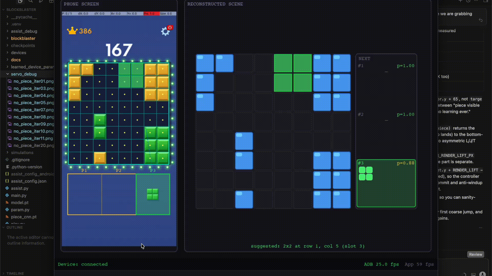
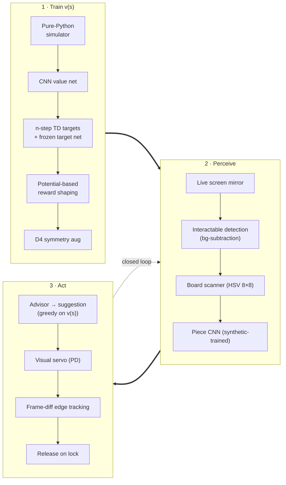

<div align="center">

# **BlockBlaster**
## A value-network agent that plays Block Blast on a real phone

*Train a value network in simulation. Recognise the live game from a mirrored screen. Drive the finger with a closed-loop visual servo. Watch the phone play itself.*

[](https://python.org)
[](https://pytorch.org)
[](https://opencv.org)
[](https://pyga.me)
[](https://github.com/Genymobile/scrcpy)



</div>

---

## What this is

Three real subsystems wired into one loop:



- **The value network** is a small CNN trained on **n-step TD targets** bootstrapped from a frozen target net, with **potential-based reward shaping** (Ng, Harada & Russell 1999) and **D4 symmetry augmentation**. Moves are chosen by a **3-piece beam search** that scores the true discounted return. An iterative `simulate → train` loop promotes a challenger to champion only when it wins a **paired multi-seed evaluation**.
- **The perception stack** segments the mirrored screen into interactable blobs (background subtraction), scans the board into an 8×8 occupancy grid (HSV), and classifies the three tray pieces with a tiny CNN **trained entirely on synthetic renders**.
- **The visual servo** closes the loop on the device: it frame-diffs the board against a pre-grab baseline to track the held piece by the **edges of its motion blob**, and PD-steps the finger until the piece's footprint is locked onto the advisor's target cells — then lifts.

See [`docs/`](docs/) for the full write-up of each part.

## Quick start

```bash
uv sync                          # install everything

# ── Train the value agent (simulation only) ──
uv run run_loop.py --rounds 10   # iterative simulate → train with promotion gate
uv run main.py                   # watch the trained agent play in a pygame window

# ── Train the piece classifier ──
uv run train_piece_cnn.py        # synth + real data → piece_cnn.pt

# ── Live on a phone ──
uv run play.py --platform ios                   # read-only assist overlay (mirrored iPhone)
uv run play.py --platform android [--serial S]  # assist + on-device auto-play (ADB)
```

In the GUI, press **`A`** to toggle continuous auto-play (Android only — needs touch injection). iOS is read-only (Apple blocks input injection without a paired Mac/Xcode signature).

## Repository tour

| Path | What lives there |
|------|------------------|
| `blockblaster/game/` | Pure-Python simulator: pieces, board, scoring, potential, env. |
| `blockblaster/model/` | State encoder, value-network CNN, checkpoint I/O. |
| `blockblaster/agent/` | `select_action`: 3-piece beam-search policy over `v(s)`. |
| `blockblaster/sim/` | Episode rollout, JSON I/O, multi-process runner. |
| `blockblaster/train/` | n-step TD dataset (+ D4 aug), trainer (target net), logger. |
| `blockblaster/piece_cnn/` | Synthetic renderer + piece classifier CNN + inference wrapper. |
| `blockblaster/assist/` | Live assist app: `vision/` (detect/scan/recognise/advise), `ui/` (pygame app, events, panels), `render/` (panel drawing). |
| `blockblaster/control/` | Device backends (ADB, screenrecord, scrcpy touch, iOS) + `servo.py` closed-loop placer. |
| `blockblaster/gui/` | Standalone offline pygame demo (`main.py`). |
| `docs/` | Subsystem documentation. |

## Documentation

| Doc | Read it for |
|-----|-------------|
| [`docs/architecture.md`](docs/architecture.md) | Folder layout, data flow, entry points. |
| [`docs/game-rules.md`](docs/game-rules.md) | Board / queue / scoring rules and the 42-piece set. |
| [`docs/algorithm.md`](docs/algorithm.md) | Encoder, value net, potential shaping, n-step TD + target net, beam-search policy. |
| [`docs/training.md`](docs/training.md) | The `simulate → train` loop, champion/challenger promotion, generated files. |
| [`docs/hyperparameters.md`](docs/hyperparameters.md) | Every knob in [`param.py`](param.py). |
| [`docs/perception.md`](docs/perception.md) | Interactable detection, board scanner, piece CNN, advisor. |
| [`docs/assist-gui.md`](docs/assist-gui.md) | Panels, key bindings / buttons, auto-play, board editing, debug overlay. |
| [`docs/visual-servo.md`](docs/visual-servo.md) | The closed-loop PD placer: edge tracking, ROI focus, containment. |
| [`docs/control-stack.md`](docs/control-stack.md) | Device backends and the scrcpy v1.20 touch tunnel. |

## Status & limitations

- **Simulation / training:** stable. `run_loop.py`, `main.py`.
- **Piece classifier:** ~99% on held-out real crops; near-deterministic on bar lengths after the resolution-preserving rewrite.
- **iOS assist:** read-only overlay (no input injection).
- **Android auto-play:** works, device-specific. Servo thresholds are tuned for the current capture resolution; the detection morphology and diff thresholds may need a small retune for very different board palettes.
- **Board detection:** auto-detected each frame; press **`E`** to manually draw the board box if detection drifts, **`R`** to recalibrate.
