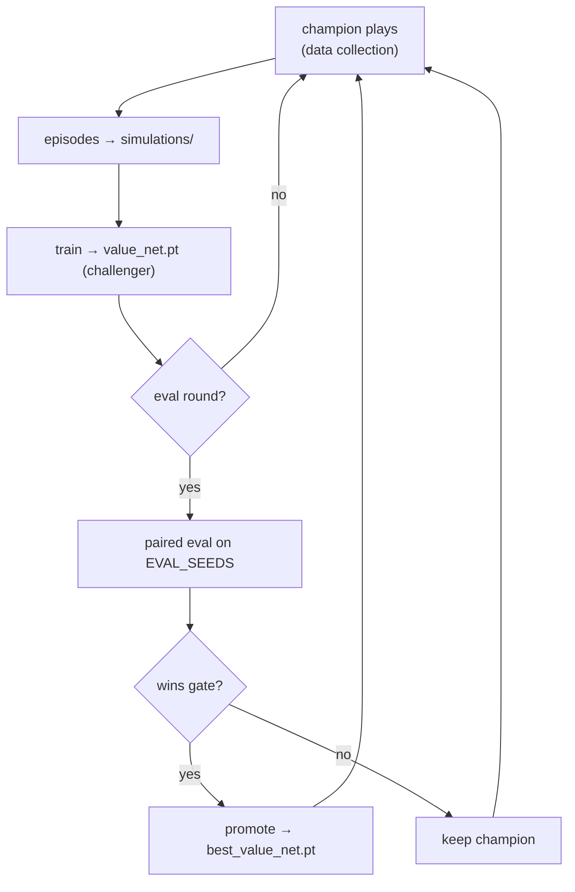

# Training

[← back to README](../README.md)

The agent improves through an iterative **self-play → fit → promote** loop driven by [`run_loop.py`](../run_loop.py). The individual stages ([`simulate.py`](../simulate.py), [`train.py`](../train.py)) are also runnable on their own.

## The loop

```bash
uv run run_loop.py --rounds 10
```

Each round:

1. **Simulate** — generate self-play episodes into `simulations/` (trimmed to `MAX_SIMULATIONS`, oldest deleted).
   - **Data-collection round:** the **champion** (`best_value_net.pt`) plays `NUM_SIMULATIONS` episodes with a per-round-varied master seed and softmax exploration (`SIM_TEMPERATURE`), adding fresh state diversity to the buffer.
   - **Eval round** (every `EVAL_INTERVAL` rounds): a **paired champion-vs-challenger** evaluation (see below).
2. **Train** — [`train.py`](../train.py) fits the net on *all* episodes currently in `simulations/` and writes the **challenger** checkpoint `value_net.pt`.

So `simulations/` is a rolling replay buffer, and each train run is warm-started from the last challenger weights.

## Champion / challenger promotion

Two checkpoints:

- `checkpoints/value_net.pt` — **challenger**, written by every training run.
- `checkpoints/best_value_net.pt` — **champion**, what simulation and the live advisor actually use.

On an eval round, [`run_loop._paired_eval_round`](../run_loop.py) runs **both** nets on the **same** per-episode seeds (derived deterministically from `EVAL_SEEDS`) so piece-stream luck cancels. The challenger is promoted to champion only if:

- it beats the champion's per-seed **median** on ≥ `PROMOTION_SEED_WIN_FRACTION` of seeds, **and**
- its overall median exceeds the champion's by ≥ `PROMOTION_MEDIAN_MARGIN` (fractional).

Bootstrap: if no champion exists yet, the challenger is promoted unconditionally.



## Checkpoint resolution during simulation

[`sim/runner.run_simulations`](../blockblaster/sim/runner.py) resolves which weights to load once per round and threads it to every worker:

- explicit `sim_path_override` (used by the champion arm of eval), else
- `force_checkpoint=True` → the challenger, else
- the champion, falling back to challenger then a random policy on the very first rounds.

Episodes run across `SIM_WORKERS` processes (spawn context, CUDA-safe).

## Generated files

| Path | Written by | Contents |
|------|------------|----------|
| `simulations/*.json` | `sim/io.write_episode` | per-episode trajectory (board, queue, reward per step) |
| `checkpoints/value_net.pt` | `train/trainer` | challenger weights + epoch / best-test-loss meta |
| `checkpoints/best_value_net.pt` | `run_loop` | champion snapshot (copied from challenger on promotion) |

## Watching it play

```bash
uv run main.py --seed 0
```

Loads the champion (falls back to a random policy with a printed warning if no checkpoint exists) and runs the offline pygame demo at a fixed seed.

## Standalone stages

```bash
uv run simulate.py   # one batch of episodes with the resolved checkpoint
uv run train.py      # one fit over the current simulations/ buffer
```

All behaviour is controlled by [`param.py`](../param.py) — see [hyperparameters.md](hyperparameters.md).
